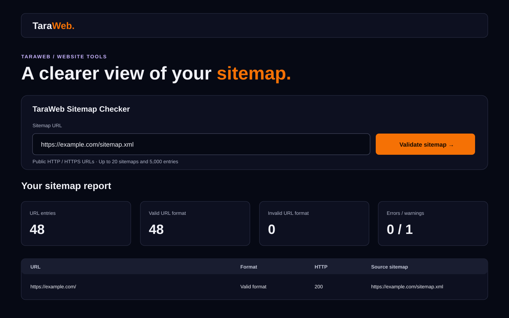

# TaraWeb Sitemap Checker

An accessible web interface, CLI, and TypeScript library for validating XML
sitemaps and sitemap indexes. The checker explains standards-based diagnostics,
can optionally sample page HTTP status codes, and exports useful results without
sending sitemap data to a third-party analytics service.

Maintained and enhanced by [TaraWeb](https://taraweb.tech).



## Features

- Validates `urlset` and `sitemapindex` XML, namespaces, required fields, URL
  rules, limits, and supported Google sitemap extensions.
- Follows child sitemap entries within explicit document, depth, and download
  limits; plain XML and `.xml.gz` sitemaps are supported.
- Presents summary cards, filterable URL rows, validation findings, and optional
  HTTP status sampling in a responsive, keyboard-accessible web UI.
- Exports URL results as CSV and the complete report as JSON. CSV output is
  hardened against spreadsheet-formula injection.
- Includes an offline CI command for generated files and a separate opt-in live
  wrapper for published sitemaps.
- Produces structured diagnostics for CI, logs, and product interfaces.

## Run the web app

Requirements: Node.js 20 or newer and npm.

```bash
git clone https://github.com/taraweb-global/taraweb-sitemap-checker.git
cd taraweb-sitemap-checker
npm ci
npm run build
npm start
```

Open `http://localhost:3000`.

The web app accepts public HTTP or HTTPS sitemap URLs. Page-status sampling is
off by default; enable it in the form when needed.

## Configuration

Copy the values from `.env.example` into your shell or hosting platform. The app
does not automatically read `.env` files.

| Variable | Default | Purpose |
| --- | --- | --- |
| `HOST` | `127.0.0.1` | Interface used by the web server. Use `0.0.0.0` in a container when required. |
| `PORT` | `3000` | Listening port. |
| `APP_ORIGIN` | `http://localhost:3000` | Exact browser origin allowed to submit validation requests. Set this to the public HTTPS origin in production. |

The service needs outbound HTTP/HTTPS access to fetch public sitemaps. No
credential or production environment value belongs in the repository.

## CLI usage

Validate a generated sitemap before deployment:

```bash
npm exec -- sitemap-validator ./build/sitemap.xml \
  --sitemap-location https://example.com/sitemap.xml \
  --detail summary
```

The file remains local; `--sitemap-location` supplies its future public URL for
host and path checks. Exit code `0` passes, `1` means diagnostics block the
selected policy, and `2` indicates invalid command usage.

For a generated sitemap index, map public child URLs to local files:

```bash
npm exec -- sitemap-validator ./build/sitemap-index.xml \
  --sitemap-location https://example.invalid/sitemap-index.xml \
  --public-url-prefix https://example.invalid/ \
  --local-sitemap-root ./build
```

The separate live wrapper can inspect an already-published sitemap:

```bash
npm exec -- sitemap-validator-live https://example.com/sitemap.xml
npm exec -- sitemap-validator-live https://example.com/sitemap.xml --check-status --check-robots
```

Live page checks are opt-in. Run `npm exec -- sitemap-validator-live --help` for
all limits, user-agent, report, and audit options.

## Library API

```ts
import { assertValidForCi, validateSitemap } from "taraweb-sitemap-checker";

const result = await validateSitemap(
  { path: "build/sitemap.xml", sourceId: "sitemap.xml" },
  { sitemapLocation: "https://example.com/sitemap.xml" },
);

assertValidForCi(result);
```

Browser code can import the dependency-free file adapter boundary from
`taraweb-sitemap-checker/browser`. See `docs/api.md`,
`docs/standards-coverage.md`, and the generated `docs/rule-matrix.md` for the
supported API and validation scope.

## Architecture

```text
web form -> bounded API -> pinned public-network fetch -> sitemap event stream
                                                      -> diagnostics + URL rows
CLI/file -> input adapters -> gzip guard -> streaming XML parser -> rule engine
                                                            -> reports / CI policy
```

The web service is intentionally thin: `src/web-server.ts` serves static assets
and its validation endpoint, `src/web-fetch.ts` owns the public-network
transport, and `src/web-audit.ts` converts existing validator events into a
bounded UI report. Core validation stays independent of HTTP fetching.

## Security model and crawler limits

Treat this as a diagnostic tool, not a network-isolation boundary.

- Only HTTP and HTTPS URLs on standard ports are accepted by the web UI.
- Credentials, fragments, localhost, internal hostname suffixes, literal
  private/reserved addresses, and DNS resolutions containing any non-public
  address are rejected.
- Each redirect destination is validated again, and the socket is pinned to the
  DNS address that passed validation to reduce DNS-rebinding exposure.
- Web requests time out after 8 seconds, follow at most 3 redirects, and accept
  at most 2 MiB per response and 8 MiB across a sitemap set.
- A web report processes at most 20 sitemap documents, depth 3, and 5,000 URL
  entries. Optional status sampling checks at most 25 valid-format URLs with
  concurrency 3.
- The API checks request size, JSON content type, the configured browser origin,
  and allows one active validation per client address. Production deployments
  should add a trusted reverse proxy, durable rate limiting, TLS, logging
  redaction, and egress firewall rules.
- The CLI live wrapper also blocks non-public targets by default. Its explicit
  `--allow-private-hosts` option is only for trusted internal audits and is not
  exposed by the web UI.

Do not place secrets in sitemap URLs: query strings may be returned in reports.
Scan only websites you are authorized to test.

## Development

```bash
npm ci
npm run typecheck
npm run lint
npm test
npm run api:check
npm run verify:release
```

`npm run verify:release` runs the full type, lint, test, coverage, documentation,
API snapshot, and package dry-run gates. CI tests Node.js 22 on Linux and
Windows. See `CONTRIBUTING.md` and `docs/release-checklist.md` before proposing a
change.

## Screenshots

The screenshot above uses illustrative `example.com` data and contains no live
customer or private-site information. Add deployment screenshots only after
reviewing them for account names, local paths, URLs, and credentials.

## Attribution and license

This project is derived from
[`@trybyte/sitemap-validator` 1.0.4](https://github.com/trybyte-app/sitemap-validator)
by Byte Team (trybyte.app). TaraWeb added and maintains the web product and the
changes listed in [NOTICE](NOTICE). No endorsement by the upstream authors is
implied.

The original Apache License 2.0 is preserved in [LICENSE](LICENSE), including
its copyright, patent, redistribution, and notice requirements. See [NOTICE](NOTICE)
for upstream attribution and a summary of TaraWeb modifications.

## Contributing

Issues and focused pull requests are welcome. Please include tests for behavior
changes, keep the offline validator separate from live website checks, avoid
fixtures containing personal data, and run `npm run verify:release` before
submitting.

TaraWeb: [taraweb.tech](https://taraweb.tech) ·
[GitHub organization](https://github.com/taraweb-global)

